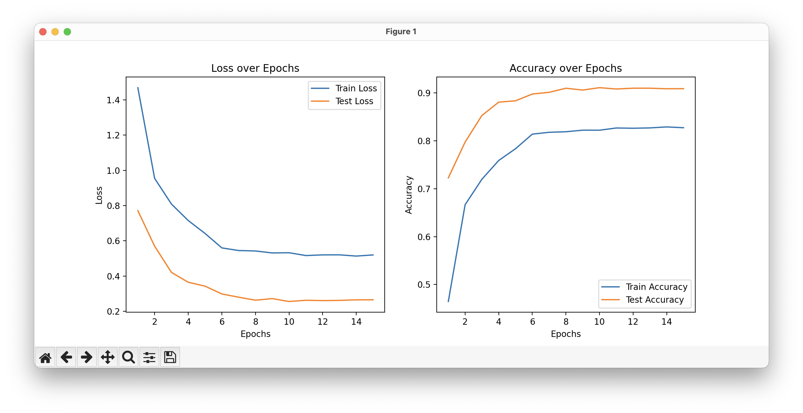

<div align="center">
  
</div>

<h3 align="center">
  <b><a href="">Online App</a></b>
  •
  <b><a href="">Python API</a></b>
  •
  <b><a href="">Demo Video</a></b>
</h3>

<div align="center">
  <a href="https://opensource.org/licenses/MIT">
    
  </a>
  
</div>
</br>

<p align="center">The <b>MNIST LeNet-5 Classifier</b> project implements the LeNet-5 model proposed by Yann LeCun in 1998 to classify handwritten digits from the MNIST dataset.</p>

## How it Works

This project is an implementation of the **LeNet-5 model**, a convolutional neural network (CNN) architecture first proposed by **Yann LeCun in 1998** for handwritten character recognition. LeNet-5 was a pioneering architecture in the field of deep learning and is highly effective for image classification tasks such as digit recognition on the MNIST dataset.

The project uses **PyTorch** for training and testing the model with data augmentation techniques, including random cropping and horizontal flipping, to improve generalization. Real-time training performance is tracked using **TensorBoard**, and the model checkpoints are saved based on the highest accuracy achieved during training.

## Features

- **LeNet-5 architecture**: A classic CNN model designed for digit classification.
- **Data Augmentation**: Random cropping and flipping for improving model generalization.
- **Training and Testing**: Trains on the MNIST dataset and evaluates performance on a separate test dataset.
- **TensorBoard Support**: Visualize training and testing metrics (loss and accuracy) in real-time.
- **Model Checkpointing**: Automatically saves the best-performing model based on test accuracy.
- **Learning Rate Scheduler**: Adapts the learning rate for optimal training efficiency.

## Run app locally

To run this project locally, follow these steps:

1. **Clone the repository**:
   ```bash
   git clone https://github.com/chloelavrat/torchLeNet-5
   cd torchLeNet-5
   ```

2. **Install the required dependencies**:
   ```bash
   pip install -r requirements.txt
   ```

3. **Run the training script**:
   ```bash
   python lenet_5/train.py
   ```

4. **Monitor training with TensorBoard**:
   Open TensorBoard to view the loss and accuracy plots:
   ```bash
   tensorboard --logdir=runs
   ```

## Python 

The Python API allows you to train, test, and save the LeNet-5 model. Here’s an overview of the key components:

- **LeNet Model**: The neural network model defined in `model.py`, following the architecture of the original LeNet-5.
- **Train Function**: Manages the training loop, logging loss and accuracy during each epoch.
- **Test Function**: Evaluates the model on the test dataset and logs the test performance.
- **TensorBoard Integration**: Training metrics are logged for visualization via TensorBoard.
- **Model Saving**: The best-performing model is saved automatically based on test accuracy.

## Training
In this demo, I trained the LeNet-5 model on the MNIST dataset for 15 epochs with a batch size of 64. The learning rate was initially set to 0.001 and decayed by a factor of 0.1 every 5 epochs.


## Contributing

This project is open-source, and contributions are always welcome! You can contribute by submitting a pull request or creating an issue on the GitHub repository.

## License

This project is licensed under the MIT License. See the [LICENSE](LICENSE) file for more details.
